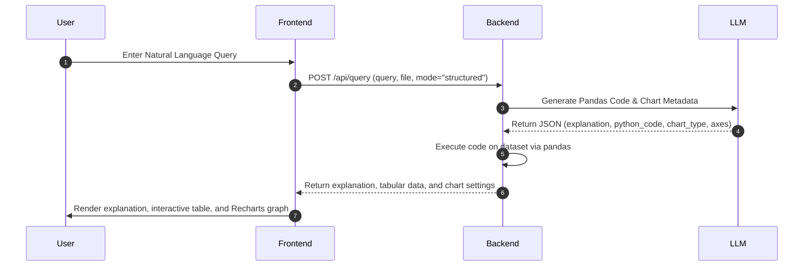
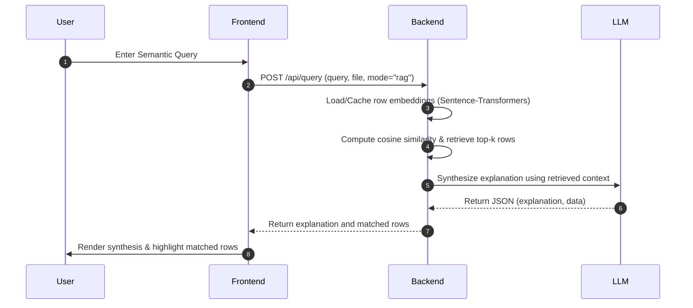

# 🌌 InsightStream — Conversational BI & Semantic Search

InsightStream is an interactive, full-stack web application that allows users to upload structured datasets (CSVs) and run natural language business intelligence (BI) queries or semantic searches. By combining modern LLM providers with powerful local heuristic and retrieval engines, InsightStream translates natural language into actionable data insights and beautiful visualizations.

---

## 🚀 Key Features

*   📊 **Dynamic CSV Profiling**: Get instantaneous metadata and statistical summaries upon upload (row/column counts, column data types, missing value percentages, mean, standard deviation, unique values, top categorical frequencies, and previews).
*   💬 **Conversational BI (Structured Mode)**: Ask analytical questions (e.g., *"What is the average expected salary by department?"*). The backend compiles your question into optimized Python/Pandas code, runs it in a safe execution environment, and returns the tabular result along with visualization recommendation settings.
*   🔍 **Semantic Search (RAG Mode)**: Perform conceptual searches across rows using a local `SentenceTransformer` embedding model (`all-MiniLM-L6-v2`). Results are retrieved via cosine similarity and synthesized into a coherent response using an LLM.
*   📈 **Rich Interactive Visualizations**: Automatically renders the resulting data using dynamic Recharts graphs (Bar, Line, Pie, and Scatter charts) equipped with sleek hover effects, tooltips, and legends.
*   ⚙️ **Multi-LLM Provider Integration**: Hot-swap between leading LLM APIs—including **Google Gemini** (e.g., `gemini-3.5-flash`), **OpenAI** (e.g., `gpt-4o-mini`), **Anthropic** (e.g., `claude-3-5-sonnet-latest`), **Ollama** (for local offline models), and a **Local Fallback Engine**—directly in the settings modal.
*   📂 **File & Cache Management**: Browse uploaded files, view active profiles, delete datasets, and maintain a local session analysis history.

---

## 🛠️ Technology Stack

### Frontend
*   **Core**: React 19, TypeScript, Vite
*   **Charts**: Recharts (dynamic responsive charts)
*   **Icons**: Lucide React
*   **Styling**: Custom CSS variables, premium Glassmorphism-style layouts, and animations

### Backend
*   **API Framework**: FastAPI (running on Uvicorn)
*   **Data Processing**: Pandas, NumPy
*   **LLM API Integrations**: Google Generative AI (`google-generativeai`), OpenAI SDK (`openai`), Anthropic SDK (`anthropic`)
*   **Local Embeddings**: Sentence-Transformers (`all-MiniLM-L6-v2`) & PyTorch for local vector computations
*   **Settings Management**: Pydantic v2 (persistent configuration in `settings.json`)

---

## 📁 Directory Structure

```text
insightstream/
├── backend/
│   ├── main.py             # FastAPI entry point, endpoints, and file management
│   ├── query_engine.py     # Code-generation, Pandas sandbox, and RAG search logic
│   ├── settings.py         # Persistent configuration models and API key handling
│   ├── settings.json       # Generated at runtime to store selected models/keys
│   ├── requirements.txt    # Python backend package dependencies
│   └── uploads/            # Local directory where CSV files are saved
└── frontend/
    ├── package.json        # Frontend scripts and dependencies
    ├── vite.config.ts      # Vite bundler configuration
    └── src/
        ├── App.tsx         # Root component and application state
        ├── index.css       # Core design system and Glassmorphism styling
        └── components/
            ├── Sidebar.tsx        # File uploads, schema viewer, and profile stats
            ├── AnalysisPanel.tsx  # Natural language query console and history
            └── Visualizer.tsx     # Recharts drawing module (Bar/Line/Pie/Scatter)
```

---

## ⚙️ Getting Started

### 1. Backend Setup
1. Navigate to the backend directory:
   ```bash
   cd backend
   ```
2. Create and activate a Python virtual environment:
   ```bash
   # On Windows (PowerShell)
   python -m venv .venv
   .venv\Scripts\Activate.ps1

   # On macOS/Linux
   python3 -m venv .venv
   source .venv/bin/activate
   ```
3. Install backend dependencies:
   ```bash
   pip install -r requirements.txt
   ```
4. Create a `.env` file (optional, or configure settings inside the app UI):
   ```text
   GEMINI_API_KEY=your_gemini_key_here
   GEMINI_MODEL=gemini-3.5-flash
   USE_LOCAL_ENGINE=false
   ```
5. Start the backend server:
   ```bash
   python main.py
   ```
   The API server will run at `http://localhost:8000` with auto-reload enabled.

### 2. Frontend Setup
1. Navigate to the frontend directory:
   ```bash
   cd ../frontend
   ```
2. Install package dependencies:
   ```bash
   npm install
   ```
3. Launch the development server:
   ```bash
   npm run dev
   ```
4. Open your browser and navigate to the address shown (usually `http://localhost:5173`).

---

## 🔄 Technical Workflows

### Structured Query Mode (Conversational BI)
Translates natural language questions into executable Pandas code:



### Semantic RAG Mode
Searches raw rows using vector similarity:



---

## 🛠️ Troubleshooting

*   **FastAPI fails to start / torch issues**: Ensure your local Python version is 3.10+ and you have successfully run `pip install -r requirements.txt`.
*   **LLM Connection Errors**: Verify that your API keys are correct. You can manage and save your API keys directly from the **Settings Gear** icon in the UI.
*   **Offline Mode**: If you do not have an API key, you can select the `local` provider in settings. InsightStream will fall back to using local similarity heuristic templates and row similarity matching using the local SentenceTransformers model.

